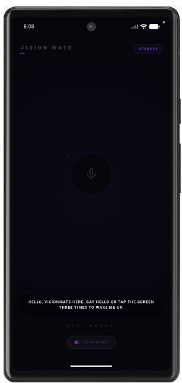
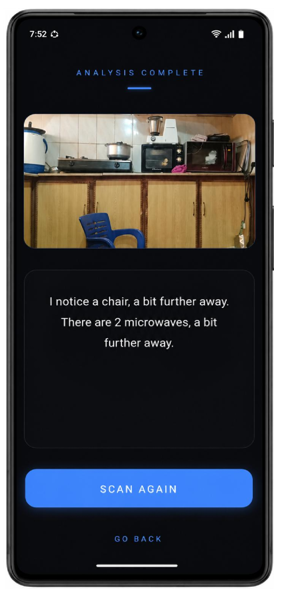
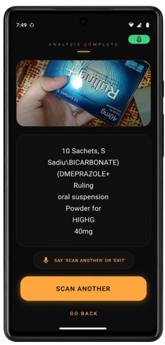
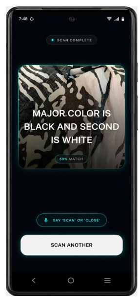
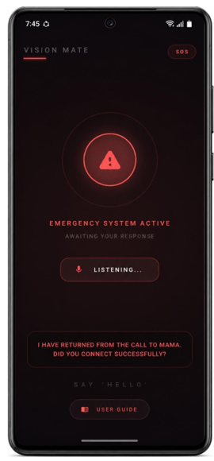
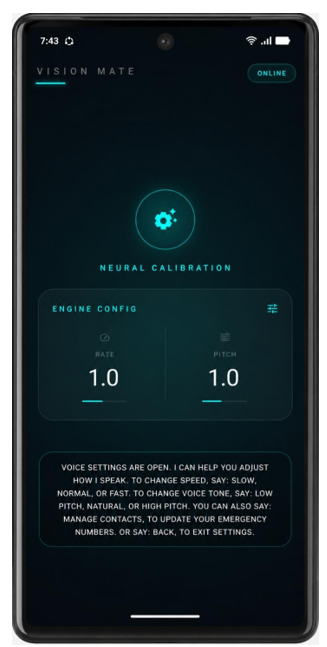

<div align="center">


# VisionMate

**AI-Powered Voice Assistant for the Visually Impaired**


</div>

---

## Overview

VisionMate is an AI-powered, voice-controlled Android application developed to assist visually impaired individuals in performing everyday tasks independently and safely. It combines computer vision, speech recognition, and accessibility-focused features into a single platform, eliminating the need for multiple assistive tools.

The system enables users to interact entirely through voice commands — detecting and locating objects, reading printed text and PDF documents, identifying colors, accessing essential utilities such as time, date, and battery status, and contacting emergency contacts when needed. A voice-guided onboarding process ensures that users can set up and navigate the application without requiring any visual interaction.

Core functionality is designed to work offline, ensuring reliability even without internet connectivity. Online services including weather updates, news access, and an AI chat assistant are available when a connection is present.

---

## Download

| Version | Release Date | Download |
|---------|--------------|----------|
| v1.0.0  | April 2025   | [VisionMate-v1.0.0.apk](../../releases/latest) |

**Requirements:** Android 10+ · 4GB RAM minimum · ~300MB storage

**Installation:**
1. Download the APK from the [Releases](../../releases) page.
2. On your device, enable **Settings → Install unknown apps**.
3. Open the APK and tap **Install**.
4. Grant Camera, Microphone, and Location permissions when prompted.
5. On first launch, complete the voice-guided onboarding to configure your emergency contact and preferences.

---

## Features

### Core Modules (Offline)

| Module | Description |
|--------|-------------|
| Voice-Guided Onboarding | Complete audio walkthrough on first launch |
| Essential Utilities | Time, date, and battery status via voice |
| Object Detection | Real-time detection and location using YOLOv8n |
| OCR & Text Reading | Live text and PDF reading via Google ML Kit |
| Color Detection | Identifies and announces object colors |
| Intelligent Camera | Auto-flashlight, blur detection, and framing guidance |
| Emergency SOS | Voice-triggered call with fallback contact support |
| Settings | Voice pitch, speed, and contact management |

### Online Features

- AI Chat Assistant (OpenAI GPT)
- Local Weather Updates (OpenWeatherMap)
- News Headlines (NewsAPI)

---

## Architecture

VisionMate uses a layered, offline-first architecture:

```
┌─────────────────────────────────────────────┐
│              Presentation Layer             │
│        Flutter UI · Voice Output · TTS      │
├─────────────────────────────────────────────┤
│           Application Logic Layer           │
│      Voice Engine · Module Router · SOS     │
├─────────────────────────────────────────────┤
│             AI Processing Layer             │
│     YOLOv8n · Google ML Kit OCR · OpenCV    │
├─────────────────────────────────────────────┤
│               Sensor Layer                  │
│       Camera · Gyroscope · Accelerometer    │
├─────────────────────────────────────────────┤
│            Device Services Layer            │
│   Android TTS · SharedPreferences · Torch   │
└─────────────────────────────────────────────┘
```

All core AI inference — detection, OCR, color identification, and speech — runs on-device. A lightweight Node.js + Express backend hosted on Render handles online API proxying only (chat, weather, news).

---


## Tech Stack

| Category | Technology |
|----------|------------|
| Frontend | Flutter (Dart) |
| Native Layer | Kotlin (Camera, Hardware) |
| Object Detection | YOLOv8n + TensorFlow Lite |
| OCR | Google ML Kit |
| Speech-to-Text | Vosk (Offline) |
| Text-to-Speech | Flutter TTS / AWS Polly |
| Color Detection | OpenCV (HSV) |
| Backend | Node.js + Express.js |
| Hosting | Render |
| Design | Figma |
| IDE | Android Studio |

---

## Project Structure

```
VisionMate/
├── app/
│   ├── lib/
│   │   ├── modules/        # Feature modules (OCR, detection, SOS, etc.)
│   │   ├── services/       # TTS, STT, camera, emergency
│   │   └── main.dart
│   ├── assets/
│   │   └── models/         # YOLOv8n .tflite model, Vosk model
│   └── pubspec.yaml
├── backend/
│   ├── routes/             # Chat, weather, news endpoints
│   ├── server.js
│   └── package.json
├── demo/
│   ├── Color Detection/
│   ├── Daily Utilities/
│   ├── Emergency/
│   ├── Object Detection/
│   ├── OCR/
│   ├── Permissions and Onboarding/
│   └── UserGuide/
├── docs/
│   └── screenshots/
├── assets/
├── LICENSE
└── README.md
```

---

## Screenshots

<div align="center">

| Home | Object Detection | OCR |
|------|-----------------|-----|
|  |  |  |

| Color Detection | Emergency SOS | Settings |
|----------------|--------------|----------|
|  |  |  |

</div>

---

## Demo

Feature demo videos are available in the [`demo/`](demo/) folder, organized by module.

---

## Getting Started

### Prerequisites

- Flutter SDK ≥ 3.0
- Android Studio (Hedgehog or later)
- Node.js ≥ 18
- Android device or emulator running Android 10+

### Frontend

```bash
git clone https://github.com/sumrunsahabkhan/VisionMate.git
cd VisionMate/app
flutter pub get
flutter run
```

### Backend

```bash
cd backend
npm install
cp .env.example .env
node server.js
```

### Environment Variables

Create a `.env` file in `/backend`:

```
OPENAI_API_KEY=your_key_here
OPENWEATHER_API_KEY=your_key_here
NEWS_API_KEY=your_key_here
PORT=3000
```

---

